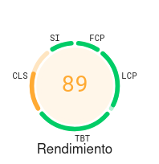
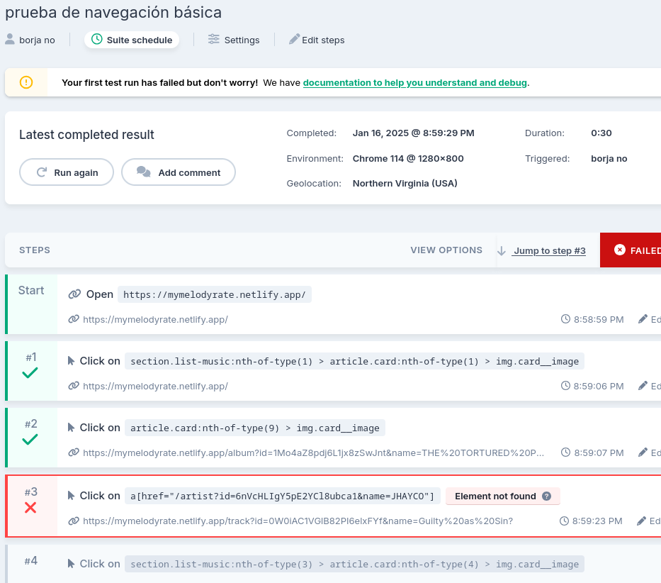
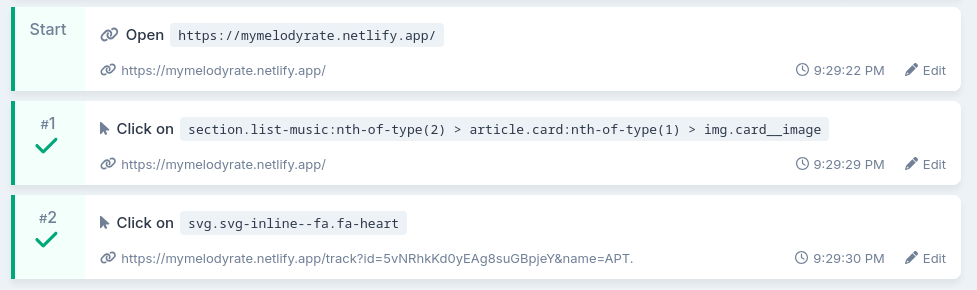

# Proyecto 4: **Testing en producción**

Naomi Jiménez Cerpa

[**Evaluación inicial de estándares y navegación	3**](#evaluación-inicial-de-estándares-y-navegación)

[Reflexión sobre los estándares y navegación intuitiva	3](#reflexión-sobre-los-estándares-y-navegación-intuitiva)

[**Pruebas de Usabilidad	3**](#pruebas-de-usabilidad)

[WebPageTest	3](#webpagetest)

[PageSpeed Insights	3](#pagespeed-insights)

[Lighthouse	3](#lighthouse)

[Ghost Inspector	3](#ghost-inspector)

# Evaluación inicial de estándares y navegación {#evaluación-inicial-de-estándares-y-navegación}

Proyecto escogido: [mymelodyrate.netlify.app](https://mymelodyrate.netlify.app)  
HTML: HTML 5  
Javascript: En concreto JavaScript ES7  
CSS: CSS3

## Reflexión sobre los estándares y navegación intuitiva {#reflexión-sobre-los-estándares-y-navegación-intuitiva}

Considero que los estándares son una cosa esencial en el desarrollo web debido a que nos deja claro qué tecnologías debemos usar y cómo debemos usarlas. Si no esto no existiese ,seguramente viviríamos en un caos en el que cada empresa y/o persona haciendo lo que quisieran como quisieran y no habría mucha compatibilidad entre herramientas. Hay gente que llegaría a considerar que los estándares limitan las formas de trabajar, pero esa limitación, en cuanto al desarrollo web, es de lo mejor que ha podido pasarnos.

Respecto a la navegación intuitiva, lo considero una parte importante a la hora de hacer un diseño de una aplicación web. El que el usuario se sepa guiar y se pueda guiar sin necesidad de mucho trabajo mental y/o físico es algo fundamental para poder retener el número de de usuarios potenciales en nuestra página, sobretodo hoy en día que vivimos en una sociedad con una necesidad preocupante de estímulos y cosas al instantes y sencillas. Es saber cómo guiar al usuario a ir donde tú quieres que vaya sin directrices verbales.

# Pruebas de Usabilidad {#pruebas-de-usabilidad}

## WebPageTest {#webpagetest}

### Home  
#### Chrome  
Me comenta que a nivel de resilencia y velocidad no está mal, se puede mejorar pero que no está mal. Hay que revisar mejor el CSS para ver por qué realentiza el cargado de la página y para asegurar que sea vea el texto adecuadamente. También podría lazy-loader las imágenes que no estén en el rango de visión del usuario para ahorrar recursos y velocidad.

Respecto a la usabilidad, comenta que las imagenes deberían tener un ratio de tamaño fijo y que el select no tiene un label asociado, cosa que sería importante de cara a la accesibilidad por si alguien usa un lector de pantalla.

#### Firefox
En firefox me ha comentado que la resilencia está perfecta, a diferencia de antes, que me decía que se podía mejorar este apartado. Supongo que se debe a cómo funcionan ambos navegadores.

Por el resto de apartados ha dado los mismos resultados.

## Evaluación de Navegación   
* Listado: En este apartado la navegación podría mejorar bastante, como poniendo un color de enlaces que permita que se lea a dónde le estás dando y un tamaño fijo a las fotos de los álbumnes. Aunque en defensa de la navegación sin ratón, se puede usar perfectamente con teclado y eso es un punto bastante positivo
  
* Producto: La información de la página se podría estructurar mejor, pero se puede navegar sin problema usando el teclado y con el ratón. Al igual que antes habría que cambiar el color de las fuentes para que se puedan leer, pero navegar como tal se puede.

## PageSpeed Insights {#pagespeed-insights}

**Home**

Cuando hablamos de los resultados de los tests de escritorio: De media tiene un 90 de puntuación en todos los apartados (menos en SEO, que tiene un 82). Respecto al rendimiento, prácticamente todo radica en una mejor optimización de las imágenes en la página mediando el uso de imágenes con formato como WebP o precargando la imagen de renderizado o también poner una altura y anchura explícita a las imágenes.

En cuanto la accesibilidad solo comentan dos cosas, el contraste de los colores de las imágenes con el fondo de la página, aunque eso era intencionado para resaltar el color del texto. También comenta que el select debe usar un label para ayudar a las personas que usan lectores de pantallas.

Todo bien respecto al apartado de prácticas recomendadas

En cuanto SEO, dice que no tengo metadatos en la página y que el archivo robots.txt está mal entero.

**Listado**

Con respecto al listado, a nivel de rendimiento y prácticas recomendables está perfecto, pues esos apartados están puntuados con un 100, pero la accesibilidad y el SEO tienen una media de 85 puntos y quiero profundizar en esos resultados.

La accesibilidad, comenta los resultados, que se pueden mejorar el contraste de colores y hacer los elementos con un mayor tamaño para la zona táctil, pues los elementos de la página son tan pequeños que no hay espacio entre ellos para un correcto uso de ello.

**Producto**

Todo bien menos el apartado de buenas prácticas y el SEO, que es debido al iframe de Spotify, pues debido a ello salen cookies de terceros, lo cual me advierte que eso es un problema de seguridad y que tal vez debería buscar otra solución para quitar ese iframe.

Con respecto al SEO añadimos otra posible mejora es poner enlaces rastreables.

## Lighthouse {#lighthouse}lighthouse

* LCP: +24
* TBT: +30
* CLS: +19
* SI: +10
* FCP: +10

Acorde a los resultados, la página no tarda mucho en pintar el primer contenido ni en renderizar el mayor elemento con contenido, además que su velocidad de indexado es muy buena, tardando 0.8 segundos. Sin embargo tarda 0.2 en cuanto cambios de diseños acumulados.

Para lidiar con ello, puedo especificar el tamaño de las imágenes para que ya se sepa que tamaño van a tener y que se precargue ese tamaño y también se puede usar  font-display: swap para precargar el texto y ahorrar posibles problemas visuales

## Ghost Inspector {#ghost-inspector}

Respecto a la prueba de navegación debo decir que no entiendo por qué Ghost Inspecto no ha podido completar el test, quiero decir, he querido acceder al álbum de un artista para ello he viajado de home a Myke Towers y desde ahí he accedido a cualquiera de sus álbumnes con facilidad mediante 3 clicks

Aquí sí se ha podido comprobar que se puede acceder la funciona correctamente la funcionalidad de agregar favoritos, al menos visualmente, pudiendo llegar en pocos clicks (una vez tengas sesión iniciada). 
No tardó en cargar ninguna de las veces y sería trampa decir que que sabía cómo acceder a los sitios, pero lo supe.